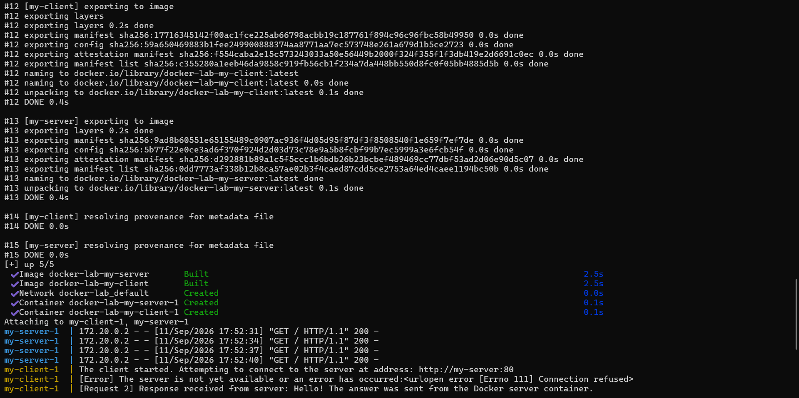
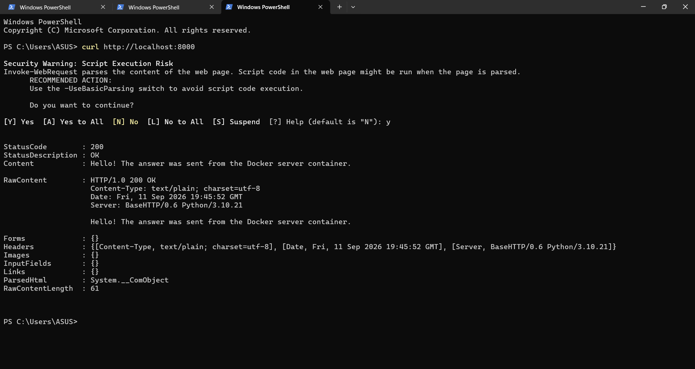
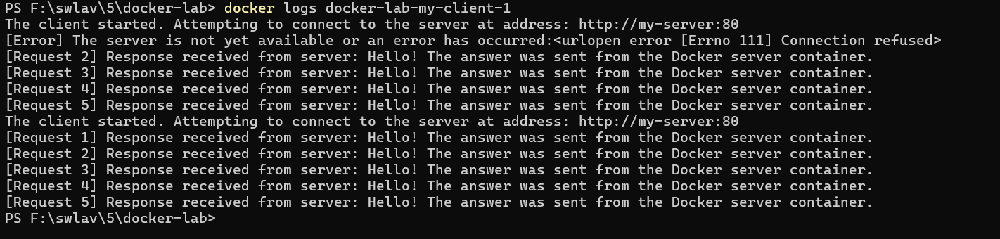
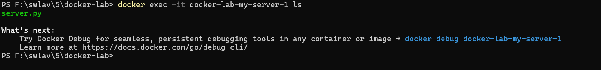

# گزارش آزمایش پنجم: آموزش اولیه داکر و استقرار نرم افزار چندکانتینری

**دانشجو:** امیرهمایون شریفی زاده  
**شماره دانشجویی:** 401106114

---

## ۱. مقدمه و اهداف آزمایش

هدف این آزمایش، آشنایی عملی با کانتینری سازی با Docker، نوشتن `Dockerfile` برای اسکریپت های پایتون و استفاده از Docker Compose برای مدیریت یک برنامه چندکانتینری است. در این سناریو، برنامه های داده شده `server.py` و `client.py` بدون تغییر در دو کانتینر مستقل اجرا شدند و ارتباط شبکه ای میان آن ها برقرار شد.

---

## ۲. ساختار پروژه

فایل ها مطابق ساختار واقعی پروژه، همگی در ریشه مخزن قرار دارند:

```text
.
├── server.py
├── client.py
├── Dockerfile.server
├── Dockerfile.client
├── docker-compose.yml
└── screenshots/
```

---

## ۳. گام اول: پیاده سازی و تنظیمات کانتینرها

### الف) Dockerfile بخش سرور (`Dockerfile.server`)

برای سرور از image سبک `python:3.10-alpine` استفاده شده است. پوشه کاری `/app` تعیین شده، فایل `server.py` به آن کپی می شود و سپس برنامه اجرا می گردد. سرور پایتون داخل کانتینر روی پورت `80` گوش می دهد.

```dockerfile
FROM python:3.10-alpine
WORKDIR /app
COPY server.py .
CMD ["python", "server.py"]
```

### ب) Dockerfile بخش کلاینت (`Dockerfile.client`)

کلاینت نیز با همان image پایه ساخته می شود. پس از کپی شدن `client.py`، برنامه اجرا می شود تا با آدرس سرور که از متغیر محیطی می خواند، درخواست ارسال کند.

```dockerfile
FROM python:3.10-alpine
WORKDIR /app
COPY client.py .
CMD ["python", "client.py"]
```

### ج) فایل پیکربندی Docker Compose (`docker-compose.yml`)

این فایل دو سرویس `my-server` و `my-client` را تعریف می کند. هر دو سرویس از Dockerfile مخصوص خود در ریشه پروژه build می شوند. پورت داخلی `80` سرور به پورت `8000` میزبان map شده است. همچنین مقدار `SERVER_HOST` برای کلاینت برابر `my-server` قرار دارد تا DNS داخلی Docker نام سرویس سرور را پیدا کند.

```yaml
services:
  my-server:
    build:
      context: .
      dockerfile: Dockerfile.server
    ports:
      - "8000:80"

  my-client:
    build:
      context: .
      dockerfile: Dockerfile.client
    environment:
      SERVER_HOST: my-server
```

---

## ۴. گام دوم: بررسی خروجی ها و تعامل با Docker

### ۱. اجرای پروژه با `docker compose up --build`

با اجرای این دستور، imageهای دو سرویس ساخته شدند، شبکه پیش فرض Compose ایجاد شد و هر دو کانتینر شروع به کار کردند. کلاینت آدرس داخلی `http://my-server:80` را برای اتصال به سرور به کار می برد.



### ۲. تست سرور با `curl`

برای بررسی Port Forwarding، دستور زیر در سیستم میزبان اجرا شد:

```powershell
curl http://localhost:8000
```

پاسخ `200 OK` و پیام سرور نشان می دهد که پورت `8000` میزبان با موفقیت به پورت `80` کانتینر سرور متصل شده است.



### ۳. بررسی لاگ های کانتینر کلاینت

با دستور زیر لاگ های کلاینت مشاهده شدند:

```powershell
docker logs docker-lab-my-client-1
```

در اجرای اول، نخستین درخواست قبل از آماده شدن سرور با `Connection refused` مواجه شد؛ چهار تلاش بعدی موفق بودند. سپس کلاینت پس از آماده شدن سرور دوباره اجرا شد و هر پنج درخواست با موفقیت پاسخ سرور را دریافت کردند. خروج کلاینت با کد `0` به معنی پایان عادی برنامه است.



### ۴. مشاهده فایل داخل کانتینر سرور با `docker exec`

با اجرای دستور زیر، محتوای فایل های کپی شده در کانتینر سرور بررسی شد:

```powershell
docker exec -it docker-lab-my-server-1 ls
```

نمایش `server.py` تایید می کند که فایل سرور به درستی در کانتینر کپی شده است.



---

## ۵. پاسخ به پرسش های تئوری آزمایش

### ۱. وظیفه `docker-compose.yml` چیست و چه زمانی به جای `docker run` از آن استفاده می کنیم؟

فایل `docker-compose.yml` سرویس ها، روش build، پورت ها، متغیرهای محیطی و شبکه موردنیاز یک برنامه چندکانتینری را در یک فایل declarative تعریف می کند. برای یک کانتینر مستقل، `docker run` مناسب است؛ اما برای چند سرویس وابسته مانند سرور و کلاینت این آزمایش، Compose باعث می شود همه اجزا با یک دستور، یعنی `docker compose up`، اجرا و مدیریت شوند.

### ۲. Kubernetes برای چه کاری استفاده می شود و چه رابطه ای با Docker دارد؟

Kubernetes سامانه ای برای استقرار، مقیاس دهی، شبکه سازی و مدیریت خودکار کانتینرها در مقیاس چند ماشین است. Docker برای ساخت image و اجرای container استفاده می شود و Kubernetes می تواند containerهای سازگار با Docker را در یک کلاستر مدیریت کند.

### ۳. Image، Container و Volume را توضیح دهید.

- **Image:** الگوی فقط خواندنی شامل برنامه، runtime و وابستگی های لازم برای اجرای آن است.
- **Container:** نمونه در حال اجرای یک image با محیط ایزوله و لایه خواندن/نوشتن مخصوص خود است.
- **Volume:** فضای ذخیره سازی پایدار Docker است که داده را مستقل از حذف یا ایجاد دوباره container نگه می دارد.

---

## ۶. استفاده از هوش مصنوعی

برای تحلیل صورت مسئله، تهیه راهنمای مرحله به مرحله، ساخت فایل های Docker و Docker Compose، و تشخیص خطای دریافت image از Docker Hub از Codex مبتنی بر GPT-5 استفاده شد. درخواست های اصلی شامل تحلیل صورت مسئله، راهنمای مرحله به مرحله، ایجاد فایل های پروژه و رفع خطای `403 Forbidden` بودند.

این ابزار در فهم مراحل، تنظیم فایل ها و تشخیص مشکل شبکه کمک کرد؛ با این حال، اجرای دستورها، مشاهده خروجی ها و تهیه اسکرین شات ها توسط دانشجو انجام شد و نتیجه به صورت عملی بررسی گردید.
